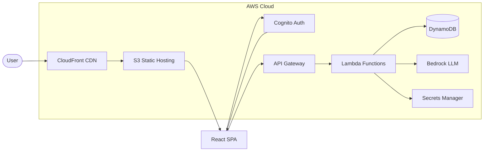

# MIRA AI ✨🌙

An AI-powered astrology companion that turns your birth details into a personalized profile and lets you chat with **MIRA** for astrology-guided reflection, interpretations, and insights.

This repository contains the full implementation of our CS6620 Cloud Computing Final Project: a modern React SPA (frontend) backed by an AWS serverless API.


## 🎯 Project Overview

MIRA blends an approachable **UI/UX** with a cloud-native backend to deliver a guided astrology chat experience:

- **Onboarding**: collect birth/profile details (used to personalize responses)
- **Authentication**: sign in via **AWS Cognito Hosted UI**
- **Chat**: send messages to the backend API (authenticated) and receive AI-generated responses
- **Persistence**: store user profile + conversation history in **DynamoDB**

### Architecture



## ✨ Key Features

- **Modern frontend experience**: responsive UI, onboarding flow, profile management, and chat layout
- **Secure auth**: Cognito Hosted UI (OAuth flow) + JWTs for authenticated API requests
- **Serverless backend**: API Gateway + Lambda handlers for chat/profile/conversation operations
- **Cloud persistence**: DynamoDB tables for user profiles and conversations
- **LLM integration**: AWS Bedrock client utilities for model calls (configurable)
- **Deployment-ready infra**: Terraform modules for key AWS resources (S3/CloudFront, DynamoDB, Cognito, etc.)

## 🛠️ Technical Implementation

### Core Technologies

- **Frontend**: React + Vite, Tailwind CSS, shadcn/ui, Framer Motion
- **Backend**: Python (Lambda-style handlers), boto3, Pydantic
- **Cloud**: AWS S3, CloudFront, Cognito, API Gateway, Lambda, DynamoDB, Bedrock, Secrets Manager, VPC
- **IaC**: Terraform (`infra/terraform/`)

### AWS Services Used

| Service | Purpose |
|---------|---------|
| **S3** | Static frontend hosting |
| **CloudFront** | CDN for global distribution and HTTPS |
| **Cognito** | User authentication (OAuth 2.0 / Hosted UI) |
| **API Gateway** | REST API routing with JWT authorization |
| **Lambda** | Serverless backend compute |
| **DynamoDB** | NoSQL persistence for user profiles and conversations |
| **Bedrock** | LLM inference for astrology-themed AI responses |
| **Secrets Manager** | Secure credential storage |
| **VPC** | Network isolation for Lambda functions |

### High-Level Cloud Flow

1. **User → CloudFront → S3** serves the static React SPA
2. **Login** via Cognito Hosted UI, returning tokens to the SPA
3. SPA calls **API Gateway → Lambda** with JWT auth
4. Lambdas read/write data in **DynamoDB** and call **Bedrock** (as configured)

> Note: The AWS resources for this class project have been terminated, so the live deployment is not currently runnable/testable.

## 📁 Project Structure

```
MiraAI/
├── app/
│   ├── frontend/              # React SPA (UI/UX + Cognito integration)
│   └── backend/               # Lambda-style Python handlers + shared utilities
├── infra/
│   └── terraform/             # IaC modules for AWS resources
├── docs/                      # Architecture diagrams, reports, screenshots
├── scripts/                   # Helper scripts
└── roles/                     # IAM policy JSONs used during development
```

## 🧩 My Contributions

- **Frontend UI/UX (end-to-end)**: implemented the entire React SPA experience (landing, onboarding/profile, chat layout, styling, components)
- **Cognito login system**: integrated Cognito Hosted UI OAuth flow on the frontend, including callback handling and token usage for authenticated calls
- **Frontend ↔ AWS backend integration**: implemented API client patterns and wired UI flows to backend endpoints (profile, chat, conversation history)
- **AWS architecture support**: helped design the system’s AWS architecture (CloudFront/S3 frontend, API Gateway/Lambda backend, DynamoDB persistence, Cognito auth)
- **IaC contributions (Terraform)**: implemented/extended infrastructure modules used for **S3 + CloudFront static hosting** and **DynamoDB** resources

> **Infrastructure as Code:** All AWS resources are defined and managed through Terraform modules in `infra/terraform/`, enabling reproducible deployments and version-controlled infrastructure changes. This includes S3/CloudFront static hosting, DynamoDB tables, Cognito user pools, API Gateway configuration, and Lambda function deployments.

## 💰 Cost Model

MIRA uses a fully serverless architecture, meaning costs scale to zero when idle:

| Resource | Pricing Model | Estimated Cost (Low Traffic) |
|----------|--------------|------------------------------|
| S3 + CloudFront | Pay per request + storage | ~$1-2/month |
| Cognito | Free tier: 50,000 MAU | $0 |
| API Gateway | $3.50 per million requests | <$1/month |
| Lambda | Free tier: 1M requests/month | $0 |
| DynamoDB | On-demand: pay per read/write | <$1/month |
| Bedrock | Per-token pricing (model dependent) | Variable |

**Total estimated cost for a low-traffic deployment: <$5/month** (excluding Bedrock inference costs, which vary by usage and model selection).

## 👥 Team

- **Erdun E**: Project Manager, Backend Expert, Software Developer  
- **Raj Kavathekar**: Frontend Expert, Web Developer  
- **Davie Wu**: Site Reliability Engineer, Infrastructure Expert, Junior Developer

## 🏗️ Architecture & Documentation

- Architecture diagrams, screenshots, and final report live under `docs/final/`
- Original architecture board: `https://miro.com/app/board/uXjVJsOlhH8=/?share_link_id=35191105301`

## 🎥 Demo

Demo video: `https://drive.google.com/file/d/1Sy8Eb1_7Cw-riR4t4dP1GMPRweUN8jyP/view?usp=sharing`

## 🧠 Generative AI (Disclosure)

- Used AI tools for wording polish, debugging discussion, and small refactors/suggestions in-editor.
- We did **not** use Generative AI to create Terraform/cloud configuration or core system architecture decisions.
