## Table of Contents  

1. Executive Summary  
2. Architecture Documentation  
3. Integration of Course Concepts  
4. Cloud Evidence  
5. Data Models  
6. Integrating Feedback  
7. Challenges, Lessons Learned, and Future Work  
8. References  
9. Use of Generative AI (Full Disclosure)  

---

## 1. Executive Summary

Mira is an AI-powered astrology companion designed to give people a simple, always-available way to reflect on their emotions and decisions. Many users already read horoscopes or follow astrology, but most existing apps are generic, one-way feeds that do not respond to a person’s specific situation. At the same time, formal mental-health or coaching services can feel too heavy, expensive, or hard to access for someone who just wants light, private guidance in everyday life.

Our solution is a conversational “cosmic companion” that feels like talking to a friendly astrologer who knows your basic profile and history. After creating an account and entering their birth details, users can chat with Mira about what they are going through and see personalized astrological insights and visual birth charts. The experience is designed to be low-pressure, judgment-free, and available 24/7 from any device.

Mira primarily benefits people who already enjoy horoscopes or reflective journaling and are looking for a more interactive, personalized experience. It matters because it offers an accessible middle ground between scrolling through generic content and seeking professional help: a private space to pause, reflect, and gain perspective during stressful or uncertain moments. By packaging this experience in a secure, cloud-based service, Mira can reliably support users across time zones without requiring constant human availability from our team.

---

## 2. Architecture Documentation

### 2.1 Architectural Diagrams

Our architecture is documented visually using a Miro diagram that captures the full end-to-end flow from the user’s browser to AWS services and external APIs. The diagram shows the public-facing frontend, the authentication flow, the API gateway, the serverless backend, and the various data and AI components behind the scenes, with clear boundaries between public and private network layers and labels for each major service.

- **Miro diagram link:**  
  [Mira Architecture – Miro Board](https://miro.com/app/board/uXjVJsOlhH8=/?share_link_id=259343820262)

- **PDF architecture diagram:**  
  [Architecture Diagram (PDF)](https://github.com/CloudComputingMIA2025/team_chengdu_boyz/blob/dev/docs/final/architecture/CS6620%20FCC%20Final%20Project%20Architecture%20Diagram.pdf)

### 2.2 High-Level System Overview

The **frontend** is a React + Vite single-page application located under `/app/frontend`. It provides the main user-facing flows: a landing page that explains Mira, onboarding and profile creation screens for collecting birth and location information, a first-time chat experience to introduce the AI astrologer, the main chat view, and a profile page where users can review and update their data. The SPA is built with Tailwind CSS, shadcn/ui, and Framer Motion to produce a polished “cosmic” theme. In production, the built assets are uploaded to an S3 bucket and served via a CloudFront distribution for low-latency global access and HTTPS termination.

For **authentication**, we use an Amazon Cognito User Pool configured via the `cognito_auth` Terraform module. Cognito manages sign-up, sign-in, password handling, and token issuance, and exposes a Hosted UI that handles most of the complex security flows on our behalf. The Hosted UI is configured with callback and logout URLs for both local development (`http://localhost:5173/callback`) and the production CloudFront domain. After a successful login, the SPA stores the JWT from Cognito (e.g., in `localStorage`) and attaches it as an Authorization header to all API requests, enabling end-to-end, token-based security without the backend handling raw passwords.

The **API layer** is implemented using an AWS API Gateway HTTP API, defined by the `api_gateway` Terraform module. This API exposes versioned endpoints for health checks, profile management, horoscope/chart requests, and chat interactions. API Gateway is configured with a Cognito authorizer that validates incoming JWTs against our User Pool, so only authenticated users can access protected endpoints. Once a request is authorized, API Gateway forwards it as a Lambda proxy event to the backend Lambda function along with the necessary headers and context.

The **backend compute** is a Python 3.10 AWS Lambda function provisioned through the `lambda_api` module as `mira-api-dev`. Within the Lambda source, the code is structured into `api` handlers and shared `common` utilities. Handlers like `profile_handler.py`, `chat_handler.py`, `health_handler.py`, and others are expected to export a standard `lambda_handler(event, context)` function. We use a shared `@api_handler` decorator (defined in the backend’s common layer) to normalize event parsing, error handling, logging, and CORS responses. This design keeps each business handler focused on domain logic while the decorator deals with boilerplate such as mapping Python responses back into API Gateway’s response format.

On the **AI and external services** side, the backend relies on two main integrations. First, it calls an external Astrologer API (documented in our repo and referenced in the top-level README) to fetch horoscope and birth chart data for each user’s zodiac sign and birth details. The API key for this external service is stored in AWS Secrets Manager via the `secrets_astrologer` Terraform module and injected into Lambda through environment variables and IAM permissions. Second, the backend calls an AWS Bedrock foundation model (`openai.gpt-oss-20b-1`) to generate emotionally aware, context-sensitive chat responses. Bedrock is reached via a VPC interface endpoint set up in the `bedrock_vpce` module so that traffic never leaves our VPC to reach the public internet.

For **data storage**, we use DynamoDB tables created by the `dynamodb_mira` module to persist user profiles and conversation-related state, along with an S3 artifacts bucket for generated charts and visualization assets. One DynamoDB table is optimized for user profile data, while another is optimized for storing conversation summaries and related metadata; both are keyed around a stable user identifier derived from Cognito. The S3 artifacts bucket stores SVG chart images and related files, while a separate S3 bucket hosts the static frontend. All tables and buckets are tagged and named according to a consistent `mira-<env>-<purpose>` pattern to make it easy to reason about the infrastructure in AWS.

Finally, **networking and security** are provided by a dedicated VPC configured via the `network_vpc` module. This module creates public and private subnets across multiple Availability Zones, attaches an Internet Gateway for public traffic, and configures routing tables and gateway endpoints for DynamoDB and S3. Lambda and the Bedrock VPC endpoint are placed in private subnets, and security groups restrict inbound and outbound flows so only necessary traffic (e.g., from Lambda to Bedrock or to DynamoDB endpoints) is allowed. The `gateway_endpoints` module further ensures that DynamoDB and S3 traffic remains inside the AWS network, improving both security and latency.

### 2.3 VPC Layout

Our VPC is designed to meet the course requirement for a multi-AZ, production-style networking layout while still remaining simple enough to manage in Terraform. The `network_vpc` module provisions a VPC with the CIDR block `10.0.0.0/16`, which provides plenty of address space for subnets and future growth. Within this VPC, we define two public subnets (`10.0.1.0/24` in `us-east-1a` and `10.0.2.0/24` in `us-east-1b`) and two private subnets (`10.0.11.0/24` and `10.0.12.0/24`), also spread across those two AZs. This layout gives us a clear separation between resources that need direct inbound internet access (e.g., NAT gateways or load balancers) and resources that should remain isolated (e.g., Lambda functions and VPC endpoints).

Routing is configured to ensure that public subnets can reach the internet while private subnets use controlled egress paths. The public route tables send `0.0.0.0/0` through an Internet Gateway attached to the VPC, which is appropriate for resources like CloudFront origins or NAT gateways that occasionally need external connectivity. Private subnets are associated with route tables that do not expose them directly to the internet; instead, they rely on VPC gateway endpoints to reach AWS services such as DynamoDB and S3. The Bedrock VPC interface endpoint is explicitly placed into the private subnets so that calls from the Lambda function to Bedrock occur entirely over the AWS private backbone network, reducing the attack surface and avoiding public internet exposure.

### 2.4 IAM Roles and Policies

IAM in our project is split into two complementary concerns: human access to the AWS account and application-level permissions for our services. From a team perspective, we defined IAM roles under `/roles` following the course’s recommended patterns. Davie acts as the primary **Administrator**, responsible for applying Terraform changes, managing sensitive settings, and unblocking the rest of the team. Raj and Erdun are **Power Users**, able to view and provision most resources via the AWS console but respecting separation of duties so that not everyone has unrestricted administrative privileges. This structure supports collaboration while reducing the chance of accidental destructive changes.

For the application itself, the `lambda_api` module provisions a dedicated **Lambda execution role** that follows a least-privilege philosophy. This role is allowed to read and write only the specific DynamoDB tables created by the `dynamodb_mira` module, limited to the ARNs exported as `user_profiles_table_arn` and `conversations_table_arn`. It can read and write to the artifacts S3 bucket but does not have wildcard access to all S3 buckets in the account. The role is also granted permission to call `InvokeModel` on a narrow list of Bedrock model ARNs (specifically `openai.gpt-oss-20b-1`), to retrieve the Astrologer API key from a specific Secrets Manager secret, and to write logs and metrics to CloudWatch. By encoding these permissions in Terraform instead of the console, we can review and version-control our security posture over time.

API Gateway and Cognito also rely on IAM primitive operations behind the scenes. API Gateway is configured to invoke the Lambda function via an integration role or resource-based policy that allows `apigateway.amazonaws.com` to call `lambda:InvokeFunction` on `mira-api-dev`. Cognito, in turn, manages identities and tokens within its own service boundary, and the application never needs direct access to Cognito’s internal IAM permissions. All of these IAM roles and policies are documented in the repository under `/roles` and wired into Terraform modules so that the entire IAM configuration can be recreated in a clean environment without manual steps.

### 2.5 Reliability, Multi-AZ, and Failure Handling

Reliability in Mira is achieved primarily by building on top of regional, managed AWS services and by designing our VPC to span multiple Availability Zones. The VPC itself defines subnets in at least two AZs for both public and private layers, which means that if one AZ experiences an outage, the other can still host Lambda instances and VPC endpoints. DynamoDB and Lambda are regional services that automatically distribute their capacity across AZs in the region, and API Gateway and Cognito are also regional, fully managed control planes. This architecture avoids single points of failure at the AZ level without requiring us to manage our own replication or failover logic.

We also considered specific **failure scenarios** and how the system should respond. If a single AZ becomes unavailable, AWS will simply run Lambdas in the remaining AZs, and our VPC-level routing and subnet definitions still provide access to DynamoDB, S3, and Bedrock. If the external Astrologer API becomes temporarily unavailable, the backend is designed to degrade gracefully—for example, by returning a clear error message or fallback response explaining that horoscope data is currently unavailable, while still allowing the user to interact with the LLM using previously cached or generalized information. If Bedrock has an outage or returns errors, the backend can still return deterministic horoscope data from the external API with a simpler, non-LLM explanation.

Operationally, we configured **CloudWatch monitoring** to detect issues quickly. A CloudWatch metric alarm named `mira-api-dev-errors` watches the `Errors` metric for our Lambda function and triggers when the sum of errors in a one-minute period is greater than or equal to one. In addition, we enabled **AWS X-Ray** tracing for the API Lambda so we can see end-to-end request traces, identify slow segments, and pinpoint where errors occur across calls to DynamoDB, S3, the Astrologer API, and Bedrock. For now, these tools are primarily used during development and testing to catch regressions early, but they also demonstrate how we would integrate SNS or email notifications in a production system. We also defined an EventBridge rule that periodically invokes the `mira-api-dev` Lambda as a “keep warm” mechanism, reducing the impact of cold starts during demos and peak usage periods. By combining multi-AZ infrastructure, managed services, and observability with CloudWatch and X-Ray, we meet the course’s reliability requirements while keeping the operational burden low.

---

## 3. Integration of Course Concepts

### 3.1 Cloud Architecture

Mira’s architecture was intentionally designed as a layered cloud-native system rather than a monolithic server. The outermost layer is the CloudFront distribution plus the S3 static site bucket, which together serve the React SPA over HTTPS and provide global edge caching. The next layer handles identity and access via Amazon Cognito; all user sessions are mediated by Cognito, and downstream components trust it as the source of identity. Behind that, API Gateway serves as the front door for all backend operations, mediating traffic between the internet-facing frontend and the private Lambda function. Finally, the Lambda function orchestrates calls to our data stores (DynamoDB, S3) and external services (Bedrock, astrology API), encapsulating the application logic in a single serverless compute layer.

This separation of concerns maps well to real-world architectures because it isolates each responsibility into the AWS service best suited to handle it. Static assets and content delivery are decoupled from compute, identity is decoupled from business logic, and state persistence is decoupled from chat orchestration. As a result, the system is easier to reason about, scale, and modify: for example, we can update the frontend independently of backend logic, or experiment with different Bedrock models without touching the React app. This architecture also positions us well for future extensions, such as adding worker Lambdas for asynchronous processing or additional microservices behind the same API Gateway.

### 3.2 IAM and Security

IAM and security run through every part of the project, from team-level access control to fine-grained service permissions. At the human level, we defined an Administrator role and PowerUser roles so that not every team member needs or uses full admin privileges, and we stored our IAM policies for these roles in the `/roles` directory as JSON. This aligns with the course’s focus on explicit, reviewable IAM configuration and ensures that role assumptions are part of our repository, not tribal knowledge.

At the application level, we rely heavily on **least privilege**. The Lambda execution role is deliberately constrained to: (1) read and write only to the DynamoDB tables created for Mira; (2) access only the specific S3 buckets we use for frontend and artifacts; (3) call a limited set of Bedrock models; and (4) read exactly one secret from Secrets Manager for the Astrologer API key. We avoid wildcard actions and wildcard resources where possible, preferring explicit ARNs exported from Terraform modules. Cognito JWTs are validated in API Gateway before they ever reach Lambda, so unauthorized requests are rejected early. Together, these practices demonstrate that we used IAM as a core design tool rather than an afterthought.

### 3.3 VPC Networking

Our decision to use a custom VPC instead of placing everything on the public internet was driven by both security and realism. By creating public and private subnets across two AZs, we can place sensitive compute (Lambda, VPC endpoints) and data access strictly in private subnets and keep only essential ingress components, such as NAT gateways or certain endpoints, in public subnets. The presence of gateway endpoints for S3 and DynamoDB ensures that even when the Lambda function accesses these services, the traffic does not traverse the public internet, which reduces exposure to common network-level attacks.

From a networking perspective, this design exercises several important course concepts: CIDR allocation, route table configuration, and the distinction between gateway and interface endpoints. For instance, the Bedrock VPC interface endpoint is targeted to private subnets and attached to a specific security group, allowing only traffic from our Lambda’s security group or authorized CIDR ranges. This setup mirrors patterns used in real production systems where outbound internet access is tightly controlled, but applications still need to reach managed services like databases, object storage, and AI APIs.

### 3.4 Compute (Serverless)

We chose AWS Lambda as the primary compute platform for Mira because it matches our usage pattern and our cost constraints. Chat interactions are inherently event-driven: a user sends a message, our backend processes it, and then there is a period of inactivity until the next message. Provisioning always-on servers or even persistent containers for this pattern would lead to idle capacity and higher operational overhead. Lambda’s pay-per-use model, automatic scaling, and integration with API Gateway are a natural fit, especially for a student project where we want to avoid managing OS patches, capacity, and auto-scaling policies.

Within Lambda, we used the `@api_handler` decorator (as described in the backend README) to standardize how API events are parsed and responses returned. This decorator handles JSON parsing, error translation into HTTP status codes, CORS headers, and logging, enabling us to focus each handler on application logic—like fetching a horoscope or generating a chart. We also took cold start behavior into account: during development, we observed that the first request after a long idle period has higher latency. To mitigate this, we configured an EventBridge “keep warm” rule that periodically invokes the Lambda with a special event, which is a practical demonstration of how to work around cold starts in a serverless architecture.

### 3.5 Storage and Databases

Storage in Mira is split between **DynamoDB** for structured and semi-structured user data and **S3** for static content and artifacts. DynamoDB is an appropriate choice for chat-related data because it offers very low-latency reads and writes, scales automatically, and handles variable, evolving schemas well. Our `dynamodb_mira` module provisions tables specifically for user profiles and conversations, and we design our keys and item types around user-centric access patterns: for example, a profile item keyed by `user_id` and a stable sort key, and conversation or summary items keyed by the same `user_id` with sort keys encoding timestamps or item types.

S3 plays two distinct roles. First, an S3 bucket configured by the `s3_static` module hosts the built SPA assets, making it easy to integrate with CloudFront for fast, cached delivery of static files. Second, an “artifacts” bucket stores generated chart images and potentially other derivative data, tagged and organized by user and chart type. Using S3 for artifacts allows us to offload large or binary data from DynamoDB and rely on S3’s high durability and cost-effective storage. The combination of DynamoDB and S3 is a common pattern in serverless architectures: DynamoDB stores metadata and quick-access state, while S3 stores heavy or long-lived assets referenced by that metadata.

### 3.6 Reliability and Multi-AZ

Reliability and multi-AZ design are baked into our choice of services and VPC configuration. DynamoDB, Lambda, API Gateway, and Cognito are all regional services that inherently run across multiple Availability Zones behind the scenes, giving us robust fault tolerance without manually managing replicas or failover. Our custom VPC ensures that the private and public subnets exist in at least two AZs as well, which is important for VPC-bound resources like interface endpoints and Lambda ENIs.

We also made explicit choices to avoid single points of failure. For example, there is no single EC2 instance or single database instance that, if it fails, would take down the system. Our configuration for CloudWatch alarms, particularly the `mira-api-dev-errors` alarm, ensures that we will notice backend issues quickly, which is a key part of operational reliability. The EventBridge keep-warm rule is another reliability-oriented feature: by reducing cold start latency, we increase the likelihood that users experience consistently responsive behavior, even when traffic is bursty or low-volume.

### 3.7 Monitoring and Logging

Monitoring in Mira is centered around AWS CloudWatch. Every Lambda invocation produces logs that are captured by CloudWatch Logs, including request traces, error messages, and any custom logging we add in the `api_handler` decorator or individual handlers. These logs are searchable through CloudWatch Logs Insights, which supports the kind of ad-hoc debugging and incident investigations we practiced during development. Additionally, we configured CloudWatch Metrics and a specific `mira-api-dev-errors` alarm so that we can see when error rates spike and, in a more production-like environment, notify an SNS topic or email distribution list.

We also considered security and privacy concerns related to logging. Because Mira deals with user-generated chat content that may include sensitive or emotional disclosures, we avoid logging full request bodies or raw messages whenever possible. Instead, logs focus on metadata such as request IDs, user IDs, and high-level error categories. This approach demonstrates an understanding of both observability and data minimization: we want enough information to diagnose problems without creating new privacy risks by storing sensitive content in logs indefinitely.

### 3.8 Infrastructure as Code (Terraform)

All of Mira’s cloud infrastructure is described as code in the `/infra/terraform` directory using Terraform. Modules such as `network_vpc`, `dynamodb_mira`, `s3_static`, `cognito_auth`, `lambda_api`, `api_gateway`, `bedrock_vpce`, `secrets_astrologer`, and `gateway_endpoints` encapsulate logical components of the architecture. The root `main.tf` file wires these modules together, passes shared variables like `name_prefix` and `environment`, and exports key outputs such as the API base URL, CloudFront domain, and DynamoDB table names.

Using Terraform has several benefits. It ensures that our infrastructure is reproducible: any team member with the appropriate IAM role can run `terraform init`, `terraform plan`, and `terraform apply` to recreate the environment from scratch. It also allows us to version control infrastructure changes alongside application code, review them in pull requests, and roll back if something goes wrong. Finally, it provides a single source of truth for our architecture; instead of guessing how a resource was configured in the console, we can inspect the corresponding Terraform module and read the configuration directly.

### 3.9 CI/CD and Testing

#### CI/CD Evidence

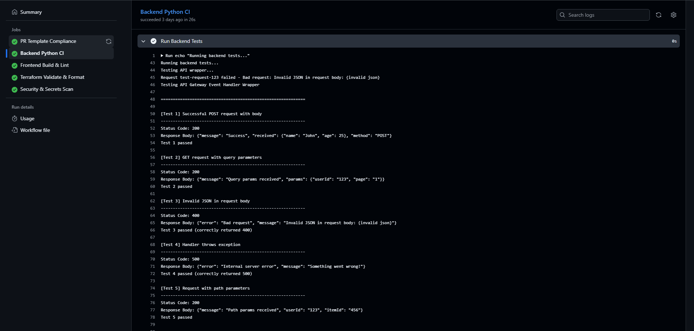  
*Figure 3.9a – Successful `ci.yml` pipeline run on GitHub Actions, showing backend, frontend, and infrastructure jobs all passing with date/time and commit details.*

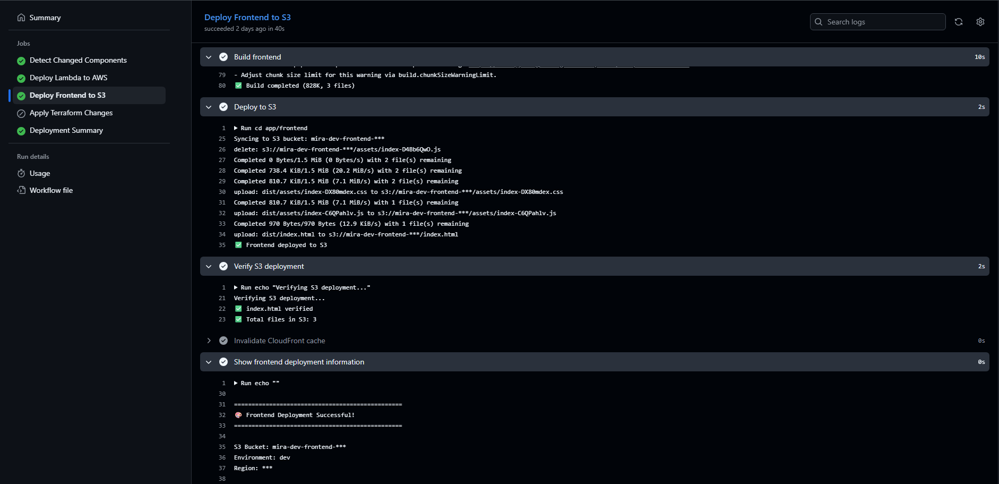  
*Figure 3.9b – Successful `cd.yml` deployment run, including Lambda update, frontend build + S3 upload, and Terraform apply.*

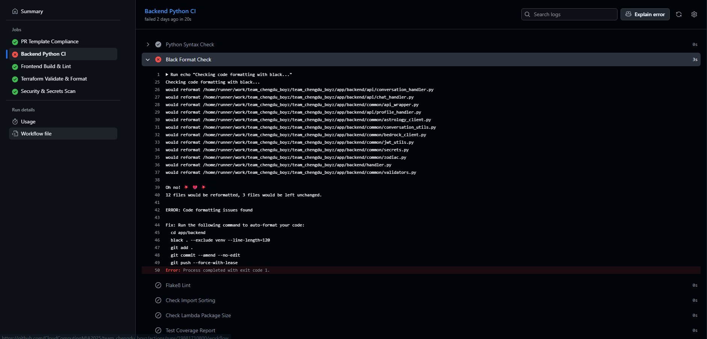  
*Figure 3.9c – Example failing CI run; we fixed the issue and confirmed the next run succeeded.*

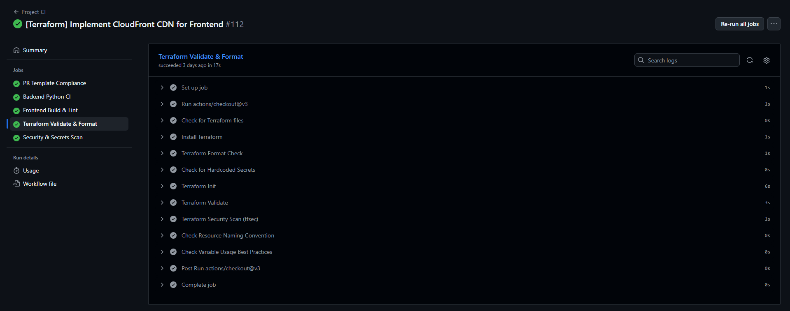  
*Figure 3.9d – Detailed view of a CI job showing the individual stages that run on every pull request.*

Key workflow runs (for reference):

- CI: [CI run](https://github.com/CloudComputingMIA2025/team_chengdu_boyz/actions/workflows/ci.yml)
- CD: [Successful deploy run to `dev` environment](https://github.com/CloudComputingMIA2025/team_chengdu_boyz/actions/runs/19881825811)
- CI failure example: [Failed CI run before fixing Terraform validation](https://github.com/CloudComputingMIA2025/team_chengdu_boyz/actions/runs/19837352302/job/56837734539)

#### Testing Strategy and Evidence

  
*Figure 3.9e – GitHub Actions CI run showing backend Python checks, frontend build and lint, and Terraform validation all passing.*

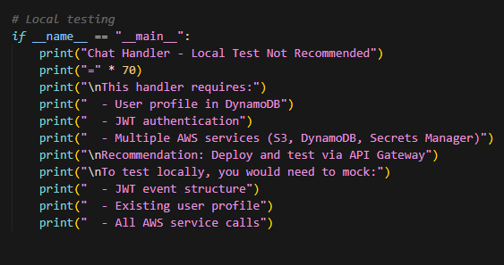  
*Figure 3.9f*

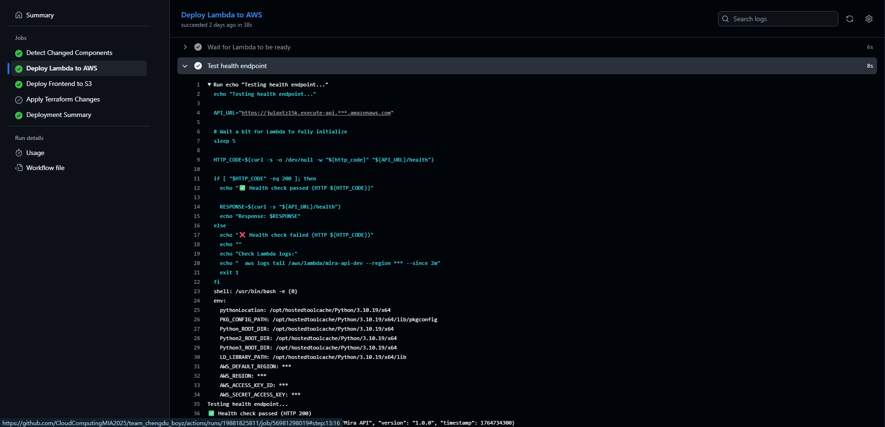  
*Figure 3.9g – Deployment pipeline calling the `/health` endpoint after updating the Lambda function, acting as a simple end-to-end integration test of API Gateway → Lambda → CloudWatch.*

Our testing strategy combines unit-level checks for core backend utilities, automated validation of infrastructure and configuration, and lightweight integration testing in the deployment pipeline. On the backend, we chose to focus our unit tests on the shared `api_wrapper` module, which all Lambda handlers use. The self-tests embedded at the bottom of `app/backend/common/api_wrapper.py` exercise normal requests, query parameters, invalid JSON bodies, exceptions thrown from handlers, and path parameters. These tests are executed automatically in CI by the “Run Backend Tests” step in the **Backend Python CI** job, ensuring that our API wrapper consistently returns the correct HTTP status codes and response formats before any code is deployed.

We also treat several of our CI checks as “tests” of the broader system configuration. The CI workflow runs Python syntax checks, Black and Flake8 on the backend, ESLint on the frontend, and a full Terraform validation and `tfsec` security scan under `infra/terraform`. These checks caught a number of issues early in development, such as misformatted Terraform files, an incorrect remote state configuration, and minor code-quality problems like unused imports and style violations; fixing these problems improved both reliability and maintainability before they could reach production. The separate `security-scan` job additionally verifies that no AWS credentials, secrets, or sensitive files are committed to the repository, which we consider part of our overall testing of the project’s security posture.

For integration testing, we implemented a simple but effective smoke test in the CD workflow: after each successful Lambda deployment, the pipeline calls the `/health` endpoint on API Gateway and fails the deployment if the HTTP status is not 200. This step verifies that the updated Lambda function is reachable through API Gateway, that the function starts correctly with the current configuration and environment variables, and that basic logging and networking are working. During development, this health check helped us catch misconfigured function names and API URLs—broken deployments that might otherwise have appeared “green” from an infrastructure perspective but would not have responded correctly to real users.

There are still areas where more automated tests would be valuable if we had additional time. In particular, we would like to add focused unit tests around `chat_handler` and the `astrology_client` / `bedrock_client` modules (for example, mocking external APIs and Bedrock to verify prompt construction, error handling, and fallback behavior), as well as component-level tests for critical frontend pages such as onboarding, chat, and profile management. Our current tests and CI checks cover core glue code, configuration, and a basic end-to-end health path, but deeper scenario-based tests and full end-to-end flows (e.g., “new user signs up → creates profile → sends first chat message → sees a valid response”) remain future work that would further increase confidence in the system.

### 3.10 Cost-Aware Design

Cost-awareness influenced several architectural decisions in Mira. Serverless services like Lambda, DynamoDB, and API Gateway are billed primarily based on actual usage, which is ideal for a student project that may see bursts of activity around demos and grading but relatively low sustained traffic. Similarly, putting CloudFront in front of an S3 static website keeps data transfer costs predictable and allows for aggressive caching of static assets, which is both economical and performant compared to running a dedicated web server.

We also prepared a detailed budget in `docs/final/budget/Estimated Cost for AWS Resources.xlsx`, where we estimated monthly costs for each major AWS resource under realistic usage assumptions. In that spreadsheet we broke the costs down by service (compute, data stores, networking, authentication, observability, and Bedrock LLM calls) and by environment (development vs. demo/production). Reviewing this breakdown confirmed that the largest variable expenses come from Bedrock invocations and Lambda execution time, while DynamoDB, S3, CloudFront, and supporting services remain relatively small. This budgeting exercise reinforced the importance of choosing managed, on‑demand services, right‑sizing capacity, and avoiding over‑provisioned, always‑on infrastructure so that the system can scale up when needed without surprising cost spikes.

---

## 4. Cloud Evidence

In this section of the report, we include annotated screenshots from the AWS console that demonstrate that our infrastructure exists and matches the architecture described above. Each screenshot has a clear caption and highlights the relevant configuration so that a reader can easily verify alignment between documentation and implementation.

**4.1 VPC and Subnets**  
We include screenshots of the VPC details page showing the `10.0.0.0/16` CIDR block and the list of public and private subnets across two Availability Zones. Additional screenshots show the route tables associated with these subnets, highlighting routes to the Internet Gateway for public subnets and the use of gateway endpoints or restricted routes for private subnets.
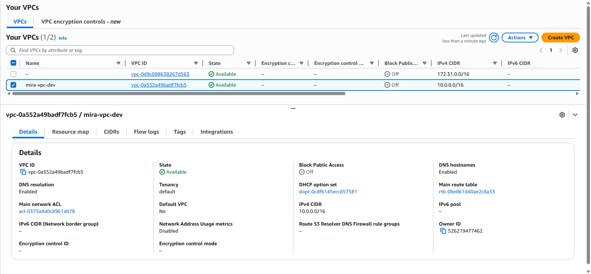  
*Figure 4.1a – VPC `10.0.0.0/16` with associated public and private subnets across two Availability Zones.*

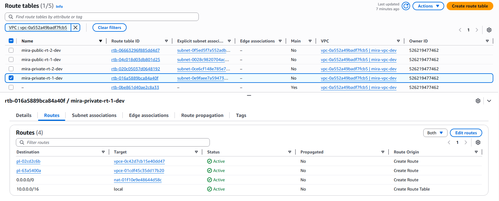  
*Figure 4.1b – Public route table sending `0.0.0.0/0` to an Internet Gateway and private route tables using restricted routes and VPC endpoints for internal AWS service access.*

**4.2 Security Groups and Network Endpoints**  
We show the security group associated with the Bedrock VPC endpoint and/or the Lambda function, including inbound and outbound rules. Another screenshot shows the list of VPC endpoints, with entries for S3, DynamoDB, and the Bedrock runtime, demonstrating that our backend calls to these services remain inside the VPC rather than going over the public internet.
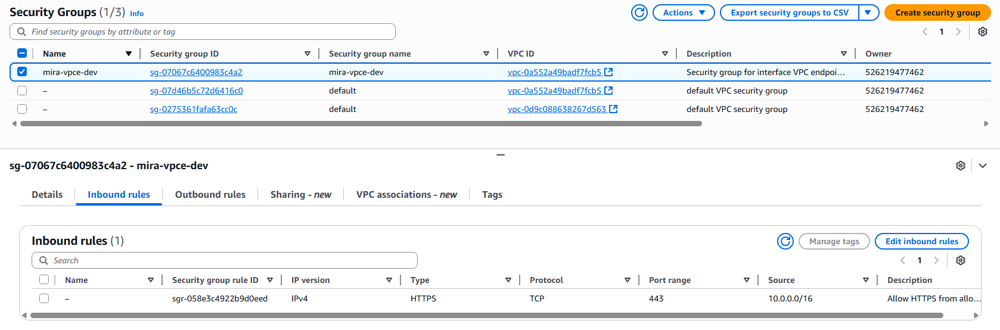  
*Figure 4.2a – Security group used by the Bedrock VPC endpoint, showing tightly scoped inbound rules and controlled outbound access.*

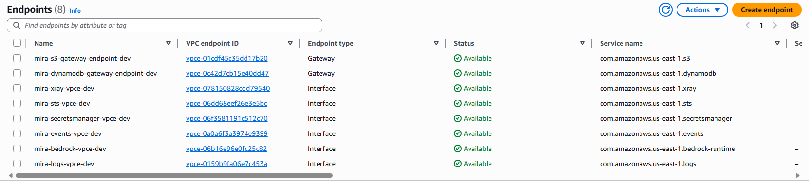  
*Figure 4.2b – VPC endpoints for S3 and DynamoDB (gateway) and the Bedrock runtime (interface), keeping traffic to AWS services inside the VPC instead of traversing the public internet.*

**4.3 Compute and API Layer**  
Screenshots of the `mira-api-dev` Lambda function display its runtime (Python 3.10), memory and timeout settings, VPC configuration (private subnets and security group), and environment variables like `DYNAMODB_PROFILES_TABLE` and `ASTROLOGY_SECRET_NAME`. We also capture the API Gateway console views that show our HTTP API, its routes, integrations, and the Cognito authorizer configuration, confirming the relationship between API Gateway, Lambda, and Cognito.
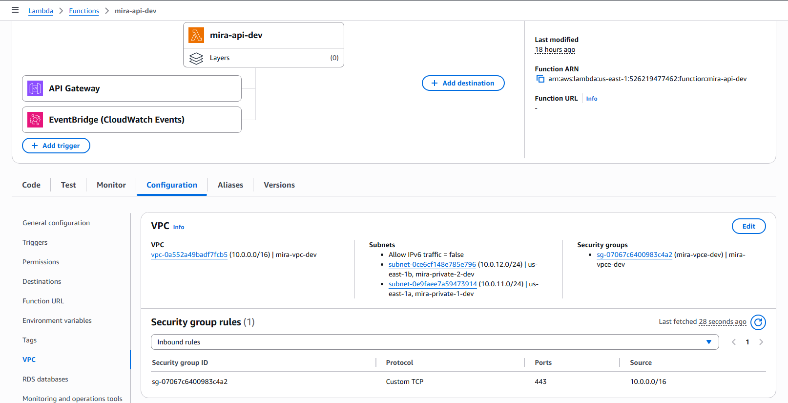  
*Figure 4.3a – Lambda function `mira-api-dev` showing the Python runtime, memory and timeout settings, VPC attachment to private subnets, security groups, and key environment variables for DynamoDB tables and Secrets Manager.*

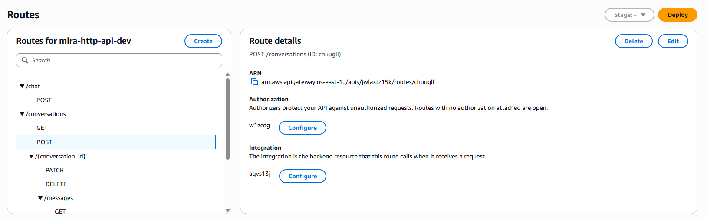  
*Figure 4.3b – HTTP API Gateway for Mira, showing routes, Lambda proxy integration to `mira-api-dev`, and Cognito authorizer enforcing JWT-based access control.*

**4.4 Storage Services**  
We provide screenshots of the DynamoDB tables provisioned for user profiles and conversations, including their table names, partition/sort key configurations, and sample items. Additional screenshots show the S3 buckets created by the `s3_static` module: the frontend static site bucket and the artifacts bucket, along with the CloudFront distribution configuration that points to the frontend bucket as an origin.
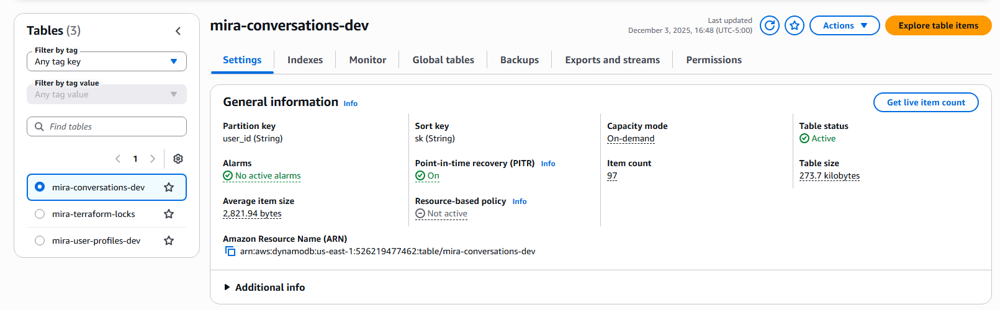  
*Figure 4.4a – DynamoDB tables for Mira user state, showing table names, partition/sort keys, and sample items for profiles and conversation summaries.*

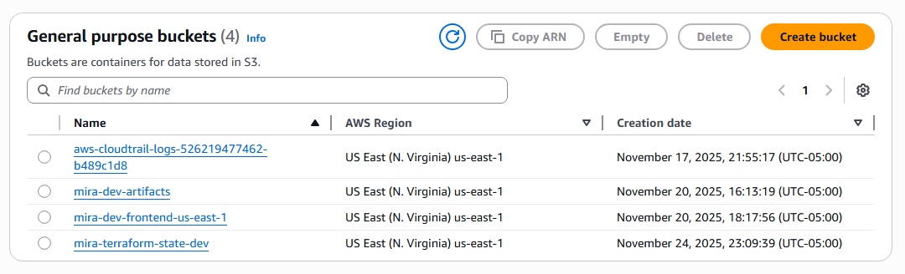
*Figure 4.4b – S3 buckets.*

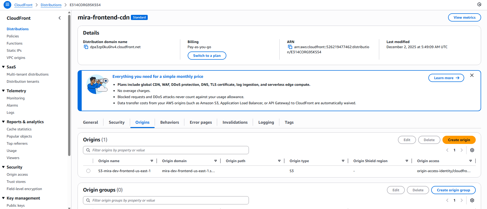
*Figure 4.4c – CloudFront distribution for the Mira frontend, configured with the static S3 bucket as its origin to serve the React SPA over HTTPS with global edge caching.*

**4.5 Logs and Metrics**  
CloudWatch screenshots show log groups for the `mira-api-dev` Lambda function, including example log streams that correspond to chat requests. We also capture the CloudWatch Metrics dashboard for Lambda errors and the specific `mira-api-dev-errors` alarm, including its threshold and evaluation period. This evidence demonstrates that we implemented monitoring in line with our documentation.
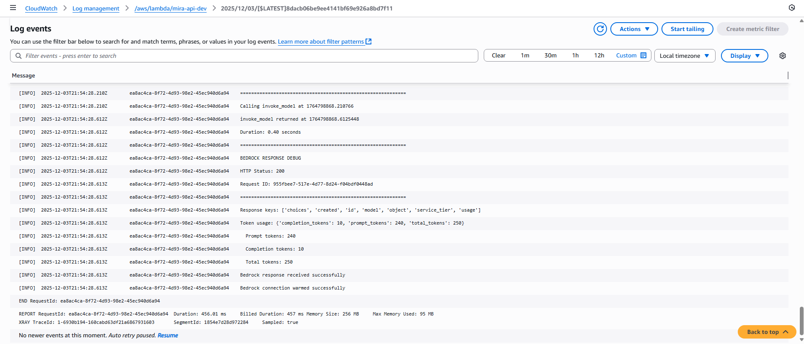  
*Figure 4.5a – CloudWatch log group for the `mira-api-dev` Lambda function, showing request logs and execution reports used for debugging and tracing individual API calls.*

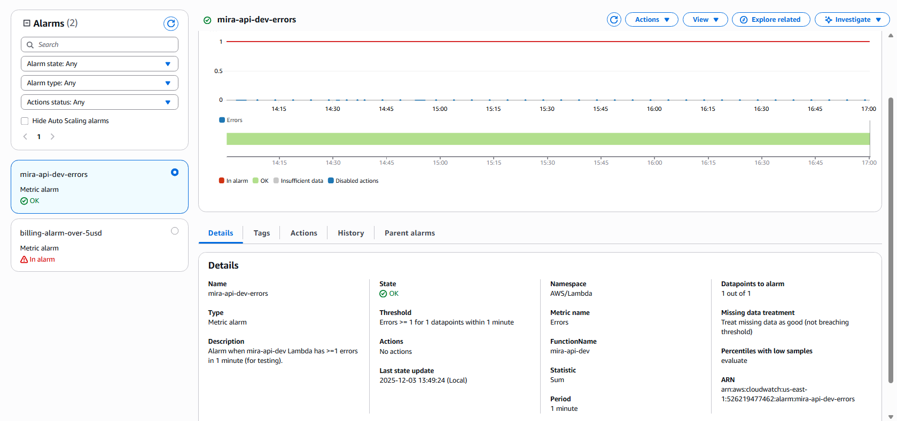  
*Figure 4.5b – CloudWatch metric and the `mira-api-dev-errors` alarm, triggering when Lambda errors exceed the configured threshold within a one-minute period.*

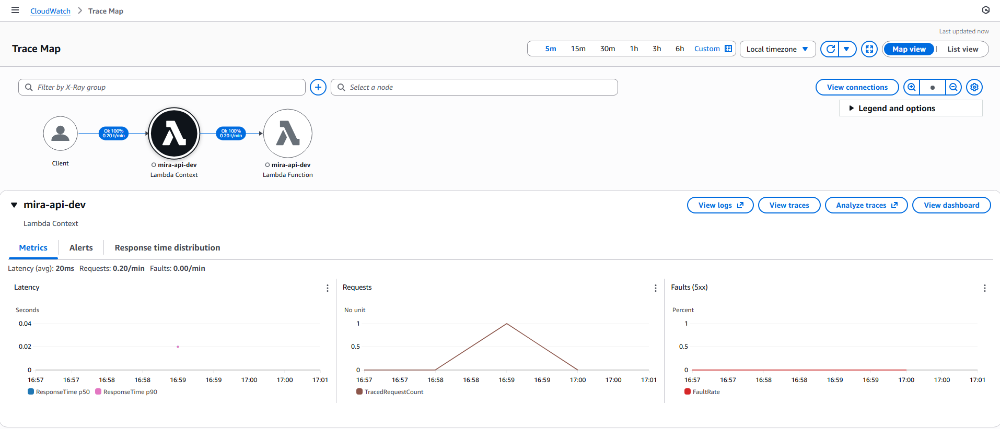  
*Figure 4.5c – AWS X-Ray trace for a single Mira API request, showing end-to-end latency and errors across Lambda and downstream service calls.*

**4.6 IAM Roles and Policies**  
Finally, we include screenshots from the IAM console summarizing the Lambda execution role and its attached policies, as well as any roles used by API Gateway or supporting services. Captions explain how these policies restrict access to particular DynamoDB tables, S3 buckets, Bedrock models, and Secrets Manager secrets, reinforcing the least-privilege approach described in the Architecture and IAM sections.
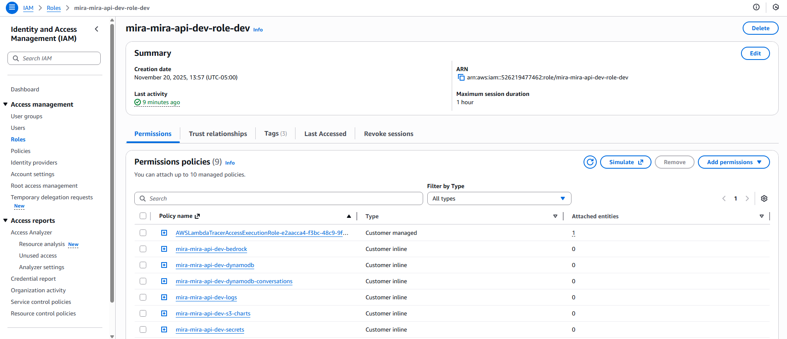  
*Figure 4.6a – IAM execution role for the `mira-api-dev` Lambda function, with least-privilege policies granting access only to the specific DynamoDB tables, S3 buckets, Bedrock model ARNs, Secrets Manager secret, and CloudWatch logging.*

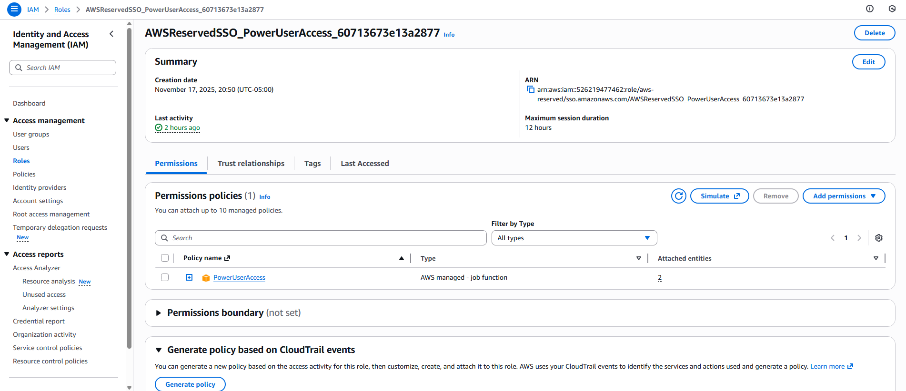  
*Figure 4.6b – Team IAM roles for Administrator and PowerUser access, used to separate full Terraform apply permissions from read-only or console-based access for other team members.*

---

## 5. Data Models

### 5.1 Data Description

Mira works with a mix of structured and unstructured data. The structured data primarily consists of **user profiles**, which include fields such as the user’s name, birthdate, birth location (country and city), computed zodiac sign, and other preferences that may influence how we interpret horoscopes and generate responses. Semi-structured and unstructured data includes individual chat messages, LLM responses, horoscope text retrieved from the external API, and various logs or metadata that describe the state of the application.

Each type of data serves a clear purpose in the system. Profile data anchors the personalized aspects of the experience: without a persistent profile, we could not generate accurate birth charts or tailor interpretations over time. Chat-related data provides context so that the AI can respond in a way that is consistent with what the user has already shared. Logs and metrics help operators understand how the system is behaving, detect errors, and audit high-level system activity without revealing sensitive message content. Together, these data types enable Mira to deliver both personalization and operational robustness.

### 5.2 Data Sources

Mira’s data comes from three primary sources. First and most importantly, **users** supply data via the frontend: they complete the onboarding/profile form with birth details and type free-form messages in the chat interface. Second, **external APIs** augment this user-provided information. The Astrologer API provides structured horoscope and chart data for specific zodiac signs and dates, while AWS Bedrock provides LLM-based responses that we combine with horoscope insights. Third, **system-generated logs and events**—such as CloudWatch logs and metrics—capture technical information about requests, errors, and performance that we use for debugging and monitoring.

The combination of these sources means that the system must handle both trusted and untrusted data. User inputs and external API responses must be validated and sanitized to prevent misuse, while system logs must be designed to store only the minimum necessary information for troubleshooting. Our data plan (`data/DataRequirements.md`) documents these considerations and influenced design decisions about where and how to store data.

### 5.3 Storage and Access Patterns

The main persistent data store is **DynamoDB**, provisioned via the `dynamodb_mira` module. This module creates tables dedicated to user profiles and conversations, both organized around a `user_id`-centric partitioning strategy. A typical pattern is to use `user_id` as the partition key and a sort key that encodes item type and, for conversation records, a timestamp, such as `CHAT_SUMMARY#<timestamp>`. This design allows us to efficiently fetch all relevant items for a single user—profile, recent chat summaries, and other state—by performing a partition key query and, optionally, sorting or filtering by the sort key prefix.

S3 serves two main purposes in Mira. First, an S3 bucket created by the `s3_static` module hosts the built React SPA static files and acts as the origin for CloudFront, which delivers the web application to users via the CDN. Second, S3 stores **artifacts** such as generated chart images (often SVG) and other visualization data. These artifacts are typically keyed by user and chart type, for example `user/<user_id>/charts/<chart_id>.svg`, and are either referenced from DynamoDB items via URIs or generated on the fly during responses. A typical access pattern is: when a user opens the chat or profile page, the backend verifies their JWT, loads the profile from DynamoDB, retrieves or computes any needed chart data (including S3 image URIs), and returns a combined view to the frontend; new chat messages result in writes to the conversations table and, when applicable, updates to summaries or sentiment metadata.

### 5.4 ERD / NoSQL Diagram

Because we use **DynamoDB as our only database** (plus S3 for artifacts), our “ERD” is really a NoSQL data modeling sketch rather than a traditional relational diagram. We store two main entity types in DynamoDB: **user profile items** keyed by `user_id` with a fixed sort key like `sk = "PROFILE"`, and **conversation‑related items** for the same `user_id` with sort keys such as `CHAT_SUMMARY#<timestamp>` or similar patterns. This design keeps all of a user’s data in a single partition so that we can efficiently load their profile and recent chats with one query.

---

## 6. Integrating Feedback

Throughout the semester we received several rounds of feedback on our architecture, data model, and documentation, and we incorporated many of these suggestions while also making deliberate decisions about what to keep. On the infrastructure side, we simplified our design to better match reality: we removed unused components such as EventBridge(Except keep-warm function), SQS, and WAF from our Terraform configuration and final architecture diagram so that only the services we actually deploy (VPC, API Gateway, Lambda, DynamoDB, S3, Cognito, CloudFront, Bedrock, and Secrets Manager) are shown. We also clarified the real data paths in our documentation: browser traffic either goes to CloudFront → S3 for static assets or directly to API Gateway → Lambda for dynamic API calls, with Cognito providing authentication and JWTs that are validated by an API Gateway authorizer and then parsed again inside Lambda using our new `jwt_utils` helper.

We also acted on feedback around secrets, networking, and reliability. We moved the external Astrologer API key into AWS Secrets Manager via a dedicated Terraform module and described explicitly in our diagrams and report how the Lambda function retrieves this secret at runtime using a tightly scoped IAM policy. For networking, we kept our gateway endpoints for S3 and DynamoDB even though they were flagged as “potentially unnecessary,” because we decided that keeping internal traffic off the public internet aligns with our security and cost goals and with the course’s emphasis on realistic VPC designs. We addressed operational feedback by enabling AWS X-Ray tracing for the API Lambda, adding a CloudWatch error alarm for `mira-api-dev`, and configuring an EventBridge “keep warm” rule so that cold starts are less likely to impact user experience during demos and peak usage.

Feedback on Bedrock and timeouts led us to think more carefully about end-to-end latency and failure handling. We documented that API Gateway imposes a ~30-second timeout and chose a 90-second Lambda timeout with the understanding that the API will be the limiting factor for user-facing calls. In response, we tuned our prompts and request sizes to keep typical LLM calls well below this limit, and we added clear error handling paths so that if Bedrock is slow or unavailable the user receives a graceful fallback message instead of a generic timeout. We also described how we would extend this with caching and more advanced retry or circuit-breaker patterns in future iterations, even if we did not fully implement all of those mechanisms within the course timeline.

Finally, we significantly evolved our **data model and conversation handling** based on feedback about multi-turn memory and scalability. Instead of a single generic table, our Terraform now provisions a dedicated `mira-user-profiles-dev` table for profiles and a separate `mira-conversations-dev` table keyed by `user_id` and a sort key (`sk`) that encodes conversation and message types, with a TTL attribute (`ttl_epoch`) to support automatic expiration of old items. We extended our API surface to include `/conversations` and `/conversations/{conversation_id}/messages` routes so that the backend can persist and retrieve multi-turn conversation threads and feed recent history into the Bedrock prompts, rather than treating each message as an isolated request. We also updated the frontend and auth flow to respect Cognito roles and claims when exposing any admin-only views, and we explicitly documented these changes in the architecture and data model sections, while noting that more advanced analytics or a separate RDS “system of record” remain future work rather than part of this semester’s scope.

---

## 7. Challenges, Lessons Learned, and Future Work

### 7.1 Challenges

Our biggest challenge was making the **end-to-end chat path inside our VPC both reliable and fast**. A single user request has to survive several sequential steps: (1) potential **Lambda cold start**, (2) creation/attachment of a **VPC network interface (ENI)**, (3) establishing a **VPC endpoint connection** to reach managed services, (4) **retrieving and calling the external astrology API**, and finally (5) **calling the Bedrock model**. Early in the project, failures or timeouts at any of these layers meant that a full request only succeeded about **30% of the time** during our tests.

To address this, we implemented the strategies. First, we added a **keep‑warm mechanism** using an EventBridge rule to periodically invoke the Lambda function, which greatly reduced cold‑start latency and ENI creation overhead. Second, we introduced a simple **cache hit/miss mechanism** for astrology data so that repeat requests for the same user and time window could be served without always calling the external API, reducing both latency and a major source of errors. Third, we **reduced the length of prompts** sent to Bedrock by summarizing prior context and trimming unnecessary details, which lowered token counts, improved model latency, and decreased the chance of timeouts. Together, these changes increased our observed end‑to‑end success rate from roughly **30% to about 99%**, turning an unreliable prototype into a system we could confidently demo.

### 7.2 Lessons Learned

This project was structured around applying the core CS6620 concepts. For each required topic, we not only implemented the feature in Mira but also learned specific practical lessons:

- **Cloud architecture (how components fit together)**:  
  Designing Mira forced us to think in terms of layers: CloudFront + S3 for the React SPA, Cognito for identity, API Gateway as the front door, a Lambda backend, DynamoDB and S3 for state, and Bedrock plus an external astrology API for AI and domain data. Building and iterating on the architecture diagram taught us how to reason about trust boundaries, data flows, and how managed services compose into a coherent end-to-end system.

- **IAM roles for us to work as a team**:  
  We created separate IAM roles (Administrator vs. PowerUser) and stored their policies in the `/roles` directory, instead of letting everyone use full admin access. This taught us how role design affects day‑to‑day collaboration—who can apply Terraform, who can inspect resources, and how to reduce the blast radius of mistakes while still keeping the team productive.

- **Security and privacy considerations**:  
  Because Mira handles potentially sensitive emotional content, we had to think carefully about authentication (Cognito-hosted sign‑in flows), secret management (Astrologer API key in Secrets Manager), and what we log. 

- **VPC networking (subnets, routing, security groups)**:  
  Implementing a multi‑AZ VPC with public and private subnets, route tables, and VPC endpoints for DynamoDB, S3, and Bedrock turned abstract networking concepts into concrete troubleshooting sessions. We learned how a misconfigured route or security group can break Lambda’s ability to reach Bedrock or external services, and how to systematically debug those connectivity issues.

- **Compute (Lambda)**:  
  Using Lambda as our only compute layer showed us what “event‑driven” really means: each chat message becomes a short‑lived invocation that orchestrates DynamoDB, Bedrock, and the astrology API. We also experienced cold starts and timeouts firsthand, and mitigated them with an EventBridge keep‑warm rule and careful tuning of memory/timeouts, which deepened our understanding of serverless performance characteristics.

- **Storage / databases (DynamoDB, S3)**:  
  Modeling user profiles and conversations in DynamoDB around `user_id` partition keys and sort‑key patterns taught us how to design access patterns first and schema second in NoSQL. Splitting storage between DynamoDB (metadata and chat summaries) and S3 (chart images and artifacts) helped us see why serverless systems often pair a key–value store with cheap object storage.

- **IAM and security (roles, policies, least privilege)**:  
  On the application side, we used Terraform to define a tightly scoped Lambda execution role that can only touch the specific DynamoDB tables, S3 buckets, Bedrock model ARNs, and one Secrets Manager secret that Mira actually needs. Iterating on these policies—fixing “AccessDenied” errors and removing wildcards—made least‑privilege feel less like a slogan and more like a practical, testable part of our development loop.

- **Reliability and multi‑AZ design**:  
  By choosing regional managed services (Lambda, DynamoDB, API Gateway, Cognito) and placing our VPC subnets across multiple AZs, we got resilience “for free” compared to running our own servers. We also thought explicitly about degradation modes—e.g., how the app should behave if the external astrology API or Bedrock is unavailable—which pushed us to design clearer error handling and fallback responses.

- **Monitoring and logging**:  
  Wiring CloudWatch Logs and creating a `mira-api-dev-errors` alarm showed us how even a small project benefits from basic observability. We learned to use structured logging and log insights queries to debug issues like failed Bedrock calls or misconfigured environment variables without having to reproduce every problem locally.

- **Infrastructure as Code (Terraform)**:  
  Managing modules like `network_vpc`, `dynamodb_mira`, `lambda_api`, and `api_gateway` in Terraform fundamentally changed how we work with AWS: we stopped “clicking in the console” and started reviewing plans, commits, and diffs. Dealing with module dependencies and occasional broken applies taught us to treat our infrastructure the same way we treat application code—with version control, code review, and rollbacks.

- **CI/CD with automated testing**:  
  Our GitHub Actions workflows run frontend/backend checks and Terraform validation on every push, so a broken test or invalid Terraform file blocks merges. This gave us direct experience with pipelines as a safety net: instead of discovering problems only during manual deploys, we learned to rely on CI feedback and to fix the pipeline when we changed how the project was built or tested.

- **Cost-conscious design choices**:  
  Choosing serverless services (Lambda, API Gateway, DynamoDB, S3, Cognito) and modeling Bedrock usage in a budget spreadsheet made us think concretely about how every architectural choice shows up on the AWS bill. The exercise of estimating monthly costs under different traffic patterns reinforced why on‑demand managed services are attractive for spiky, low‑to‑medium‑traffic workloads like Mira and for student projects in particular.

### 7.3 Future Work

If we had more time, there are several areas where we would extend and improve Mira. On the **user experience and UI side**, we plan to design a more polished and responsive interface with clearer navigation, richer visual affordances for charts and insights, and smoother mobile/desktop experiences. This would make it easier for users to understand complex astrological information at a glance and feel more immersed in their daily reflections.

On the **AI and astrology data side**, we would like to support a broader range of LLM models and add a more flexible routing layer so that different tasks (e.g., gentle reflection vs. analytical breakdowns) can leverage the most suitable model. We also plan to integrate additional astrology API endpoints to power deeper relationship insights, more advanced natal and transit analysis, and “cosmic timing” features (e.g., windows of opportunity or caution around specific themes).

On the **engineering and operations side**, future work could include more comprehensive testing (integration and end-to-end tests that hit the deployed API), more advanced deployment strategies (such as blue-green or canary deployments for Lambda and frontend versions), and better cost and usage monitoring dashboards. We would also continue to refine our safety guardrails and content filters, including clearer disclaimers and escalation suggestions, to keep Mira both helpful and responsible as it evolves.

---

## 8. References

- Astrologer API – `https://github.com/g-battaglia/v4.astrologer-api`  
- GeoName API
- AWS Documentation – Amazon Cognito, AWS Lambda, Amazon DynamoDB, Amazon API Gateway, Amazon S3, Amazon CloudFront, Amazon VPC, AWS Secrets Manager, Amazon CloudWatch, AWS Bedrock.  
- Course materials and lecture notes from CS6620 Cloud Computing (architecture patterns, IAM best practices, VPC design, serverless, monitoring, and cost management).  
- Any additional blog posts, tutorials, or reference architectures consulted during the project (to be filled in with specific URLs and citation style preferred by the instructor).

---

## 9. Use of Generative AI (Full Disclosure)

Tool usage (summary):

- **ChatGPT**: Used to rephrase and polish wording in our README, progress documents, and this final report, and to refine pull request descriptions based on text we had already written.
- **Claude AI**: Used to talk through debugging strategies and understand error messages or edge cases; we then wrote and modified the actual code ourselves.
- **Base44**: Used at the very beginning of the project to scaffold an initial React frontend template provided as part of the course resources; we customized and extended this code manually and did not use Base44 for cloud infrastructure, Terraform, or report writing.
- **Cursor AI assistant**: Used inside the IDE for small refactors, formatting, and comment/variable name suggestions, and to surface potential bugs; we treated these as hints and only committed changes we understood.
- **Arcade**: Used solely to record and share our demo video; it did not generate any code or written project content.

We did **not** use any Generative AI tools to generate cloud-related code (including Terraform, AWS configuration, or CI/CD), to write tests or data models, or to design our architecture. All technical decisions, infrastructure definitions, and application logic were created by the team, with AI tools used only to improve clarity, organization, and presentation of material we authored ourselves. 